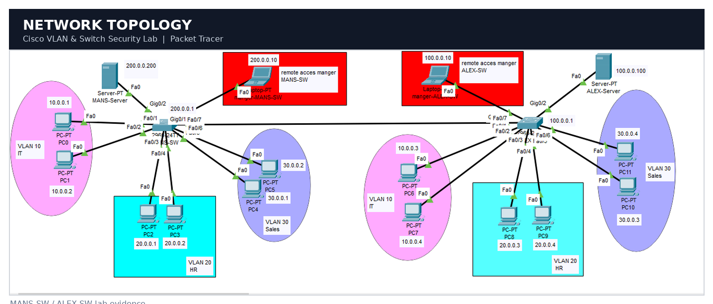
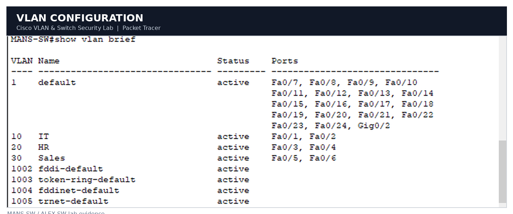
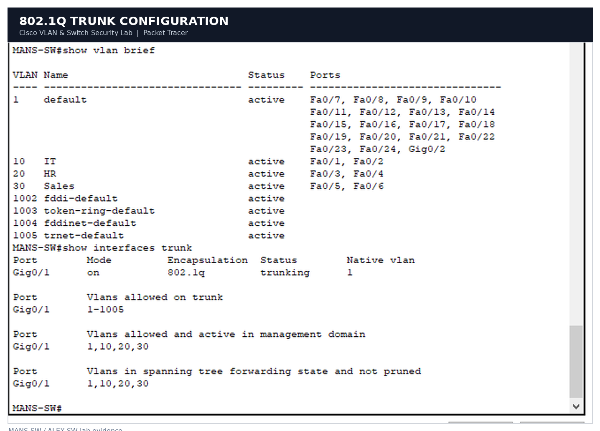
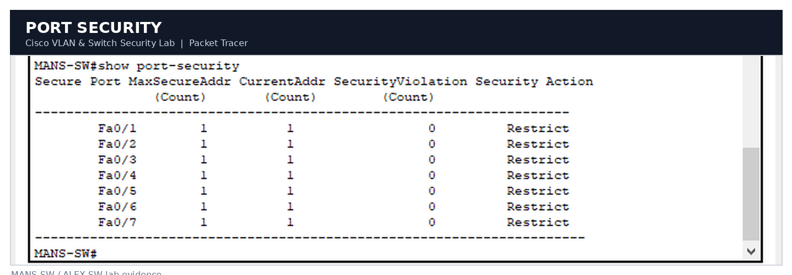
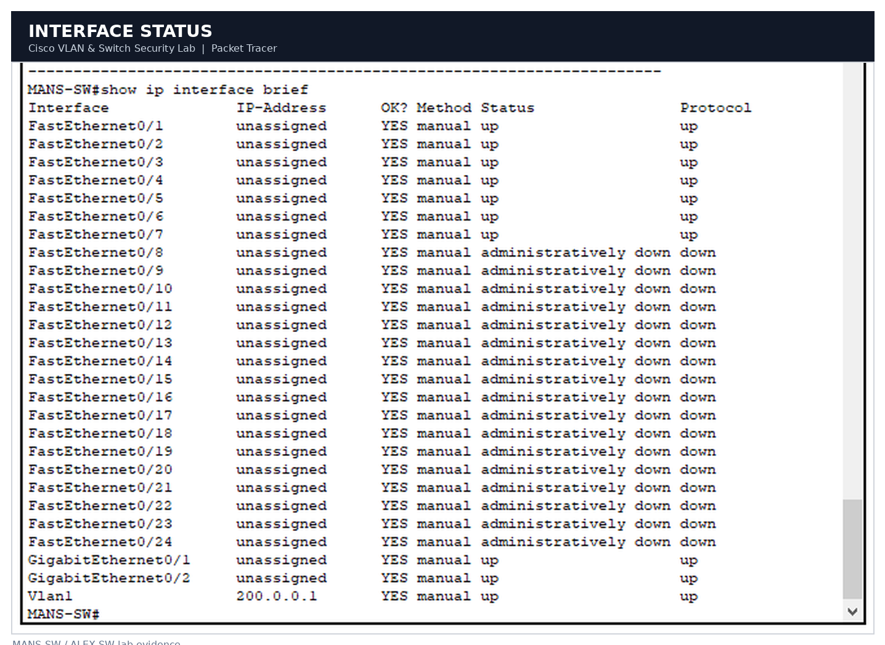
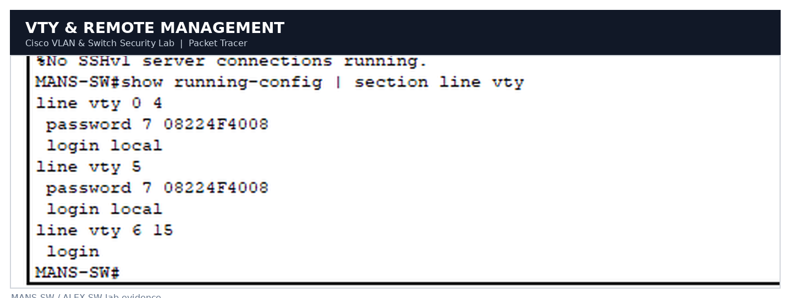

# 🌐 Cisco VLAN & Switch Security Lab

### Cisco Packet Tracer • Network Infrastructure • Switch Security

 

 

**VLAN Segmentation** &nbsp;•&nbsp;
**802.1Q Trunking** &nbsp;•&nbsp;
**Port Security** &nbsp;•&nbsp;
**Remote Management**

---
## 📌 Project Overview

> A practical Cisco Packet Tracer lab designed to demonstrate **enterprise switching, VLAN segmentation, network security, and remote device management**.

This project simulates a small enterprise network using two Cisco switches:

- 🏢 **MANS-SW**
- 🏢 **ALEX-SW**

The lab focuses on configuring and securing the switching infrastructure while providing controlled communication between different departments.

### 🎯 Main Objectives

| Area | Implementation |
|---|---|
| 🌐 Network Segmentation | VLAN 10, VLAN 20, VLAN 30 |
| 🔗 Inter-Switch Connectivity | 802.1Q Trunking |
| 🔐 Switch Security | Port Security + Sticky MAC |
| 🛡️ Device Hardening | Password Protection + Unused Ports Shutdown |
| 💻 Remote Management | VTY + Local Authentication |
| 🌳 Loop Prevention | PVST |
| 🧪 Testing | Cisco IOS Verification Commands |

---
## 🗺️ Network Topology

The lab consists of two Cisco switches connected through an **802.1Q trunk link**, with dedicated VLANs for different departments.

  

### 🔌 Core Connections

| Device | Interface | Connection |
|---|---|---|
| MANS-SW | G0/1 | Trunk → ALEX-SW |
| ALEX-SW | G0/1 | Trunk → MANS-SW |
| ALEX-SW | G0/2 | Trunk → Server-ALEX |

> **Design:** VLAN traffic is carried across the inter-switch trunk while access ports are assigned to their respective departments.

---
## 🌐 VLAN Architecture

The network is segmented into separate VLANs to organize departments and isolate Layer 2 broadcast domains.

  

| VLAN | Department | Network Role |
|:---:|:---|:---|
| 🟦 **10** | IT | IT Department |
| 🟩 **20** | HR | Human Resources |
| 🟧 **30** | Sales | Sales Department |

### 🔹 VLAN Design

- **VLAN 10** → IT
- **VLAN 20** → HR
- **VLAN 30** → Sales
- Access ports are assigned according to department.
- VLAN traffic is transported between switches through the trunk link.

---
## 🔗 802.1Q Trunking

The inter-switch connection uses **IEEE 802.1Q trunking** to carry traffic from multiple VLANs across a single physical link.

  

### 🔌 Trunk Configuration

| Switch | Interface | Mode | Connected Device |
|:---|:---:|:---:|:---|
| MANS-SW | G0/1 | Trunk | ALEX-SW |
| ALEX-SW | G0/1 | Trunk | MANS-SW |
| ALEX-SW | G0/2 | Trunk | Server-ALEX |

### ⚙️ Verified Parameters

- **Encapsulation:** IEEE 802.1Q
- **Trunk Interface:** GigabitEthernet 0/1
- **Allowed VLANs:** 10, 20, 30
- **Purpose:** Carry multiple VLANs between network segments

> 💡 **Why Trunking?**  
> A trunk allows multiple VLANs to share the same physical connection while maintaining logical network separation.

---
## 🔐 Port Security

Access ports are secured using Cisco **Port Security** to control which MAC addresses are allowed to access the network.

  

### 🛡️ Security Configuration

| Feature | Configuration |
|---|---|
| 🔒 Port Security | Enabled |
| 🧠 MAC Learning | Sticky MAC |
| 🚫 Violation Mode | Restrict |
| 🔌 Port Type | Access |
| 🛡️ Purpose | Prevent unauthorized devices |

### ⚙️ Security Approach

- Port Security is enabled on access ports.
- Sticky MAC dynamically learns connected device MAC addresses.
- Unauthorized MAC addresses trigger the configured violation behavior.
- Unused switch ports are administratively shut down.

> **Security Goal:** Reduce the risk of unauthorized devices connecting to the internal network.

---
## 🖥️ Interface & Management Status

Cisco IOS verification commands were used to validate interface states and management connectivity.

  

### 🌐 Management Interfaces

| Device | Management IP | Status |
|:---|:---:|:---:|
| MANS-SW | `200.0.0.1/8` | Active |
| ALEX-SW | `100.0.0.1/8` | Active |

### 🔎 Verification

The `show ip interface brief` command was used to verify:

- Interface status
- IP addressing
- Administrative state
- Operational state

---
## 💻 Remote Management

The switches are configured for remote administration through **VTY lines** using local user authentication.

  

### 🔑 VTY Configuration

| Feature | Configuration |
|:---|:---|
| 👤 Authentication | Local User Database |
| 💻 Access Method | VTY Lines |
| 🔐 Password Protection | Enabled |
| 🌐 Remote Administration | Configured |

### 🛡️ Management Security

- Local username authentication
- Password-protected VTY access
- Encrypted passwords
- Enable secret protection
- MOTD security banner

> **Note:** Remote management is configured for the Packet Tracer lab environment.

---
## 🛡️ Security Highlights

| 🔐 Security | 🌐 Networking | 💻 Management |
|:---:|:---:|:---:|
| Port Security | VLANs | VTY Access |
| Sticky MAC | 802.1Q Trunking | Local Authentication |
| Violation Restrict | PVST | Password Protection |
| Unused Ports Shutdown | Cisco IOS | MOTD Banner |

---

## 🧰 Technologies & Concepts

- Cisco Packet Tracer
- Cisco IOS
- VLAN Segmentation
- IEEE 802.1Q Trunking
- Port Security
- Sticky MAC
- PVST
- VTY Remote Access
- Network Troubleshooting
- Switch Hardening

---

## 📁 Project Files

| File | Description |
|:---|:---|
| `VLAN-FINAL.pkt` | Complete Cisco Packet Tracer project |
| `01-network-topology.png` | Network topology |
| `02-vlan-configuration.png` | VLAN configuration |
| `03-trunk-configuration.png` | 802.1Q trunk configuration |
| `04-port-security.png` | Port Security configuration |
| `05-interface-status.png` | Interface status |
| `06-vty-remote-management.png` | VTY remote management |

---
## 🔑 Lab Credentials

> ⚠️ **These credentials are for this Cisco Packet Tracer lab only.**
> Do not reuse them on real network infrastructure.

| Access | Username | Password |
|:---|:---:|:---:|
| 💻 Local / VTY | `mohanad` | `ccna` |
| 🔐 Privileged EXEC | — | `ccna` |

### 📌 Remote Access

Use the configured VTY lines to access the switches remotely.

**Username:** `mohanad`  
**Password:** `ccna`
## 🚀 How to Use

1. Download `VLAN-FINAL.pkt`.
2. Open the file using **Cisco Packet Tracer**.
3. Wait for the topology to load.
4. Select any switch to access the Cisco IOS CLI.
5. Use the credentials above for the configured VTY/local access.

> 💡 This project is provided as a practical networking lab for learning and demonstration purposes.
## 👨‍💻 Author

### Mohannad Mahmoud

**IT Support Engineer & IT Instructor**

`Networking` • `Windows Server` • `Network Security`

 

---

### 🚀 Cisco Networking Lab

**Designed & Implemented with Cisco Packet Tracer**

⭐ If you find this project useful, consider giving it a star.

